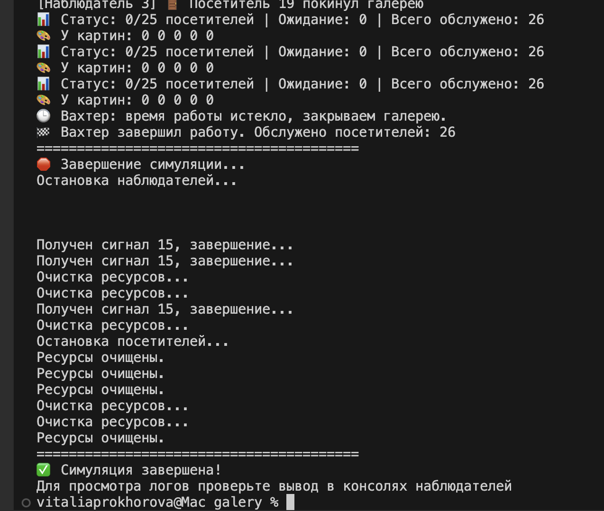
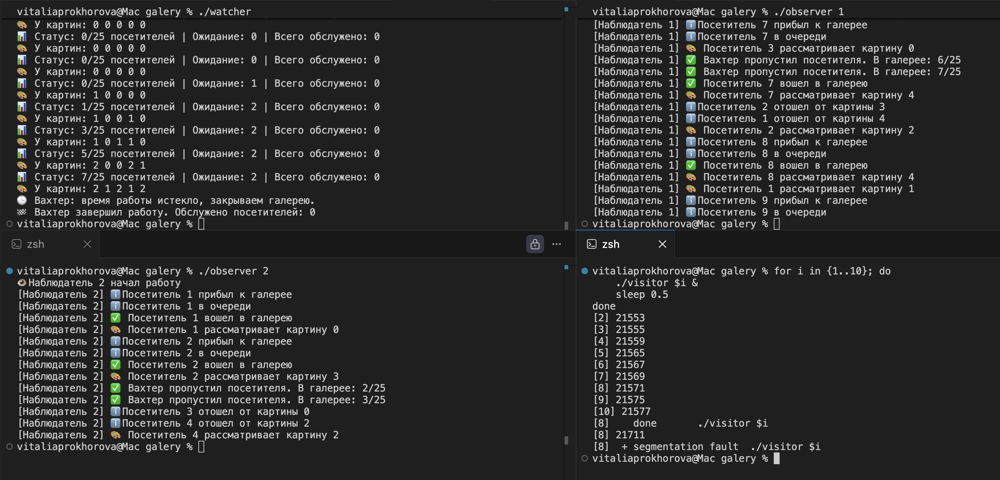

# Моделирование работы картинной галереи ИДЗ3

## 1. Выполнила
* **Прохорова Виталия Олеговна**
* Группа - БПИ244
* Вариант - 22
## 2. Условие задачи
* В галерее одновременно не более 25 посетителей
* 5 картин для обозрения
* У каждой картины не более 5 человек одновременно
* Посетители случайно переходят между картинами
* При заполненности картины посетитель ожидает
* Посетители имеют уникальные номера
* Новые посетители постоянно пытаются войти
* Ограничение общего числа посетителей: 100-300
## 3. Сценарий решения
Сущности и их отображение в процессы:
* Вахтер → процесс watcher
* Посетители → процессы visitor (множество экземпляров)
* Наблюдатели → процессы observer (множество экземпляров)

Взаимодействие процессов:
* Через именованные POSIX семафоры для синхронизации
* Через разделяемую память POSIX для обмена данными
* Через буфер сообщений для связи с наблюдателями
## 4. Структура
``` 
galery/
├── cleanup           # Исполняемый файл очистки
├── cleanup.cpp       # Исходный код очистки
├── common.cpp        # Общие функции
├── common.h          # Общие определения
├── Makefile          # Сборка проекта
├── observer          # Исполняемый файл наблюдателя
├── observer.cpp      # Исходный код наблюдателя
├── README.md         # Документация
├── run_simulation.sh # Скрипт запуска
├── visitor           # Исполняемый файл посетителя
├── visitor.cpp       # Исходный код посетителя
├── watcher           # Исполняемый файл вахтера
└── watcher.cpp       # Исходный код вахтера
```

## 5. Реализация по требованиям
### 4-6 баллов:
- ✅ POSIX семафоры и разделяемая память
  - Файлы: common.h, watcher.cpp, visitor.cpp
  - Функции:
    - sem_open() - создание именованных семафоров
    - shm_open() + mmap() - разделяемая память
    - GalleryState структура - общее состояние
- ✅ Корректное завершение и очистка ресурсов
    - Файлы: common.cpp, cleanup.cpp
    - Функции:
        - signal_handler() - обработка SIGINT/SIGTERM
        - cleanup_resources() - удаление семафоров и памяти
        - sem_unlink(), shm_unlink() - освобождение ресурсов
- ✅ Вывод информации процессами
    - Файлы: watcher.cpp, visitor.cpp, observer.cpp
    - Функции:
        - Watcher::print_status() - статус галереи
        - Visitor::send_message() - действия посетителя
        - std::cout вывод в консоль
### 7-8 баллов:
- ✅ Именованные POSIX семафоры
    - Файлы: common.cpp, visitor.cpp
    - Функции:
        - sem_open() с именами /gallery_entry, /painting_0, etc.
        - Глобальные константы имен семафоров
- ✅ Независимые процессы
    - Файлы: все .cpp
    - Функции:
        - main() в каждом процессе
        - Запуск: ./watcher, ./visitor 1, ./observer 1
- ✅ Вывод в разные консоли
    - Файлы: observer.cpp, watcher.cpp, visitor.cpp
    - Функции:
        - Observer::display_message() - форматированный вывод
        - Индивидуальный std::cout для каждого процесса
### 9 баллов:
- ✅ Процесс-наблюдатель 
    - Файлы: observer.cpp
    - Функции:
        - Observer::Observer() - инициализация
        - Observer::run() - главный цикл
        - Observer::process_messages() - обработка сообщений
- ✅ Передача информации через буфер сообщений
    - Файлы: common.cpp, visitor.cpp, watcher.cpp
    - Функции:
        - send_message() - отправка в буфер
        - receive_message() - чтение из буфера
        - MessageBuffer структура - кольцевой буфер
- ✅ Интеграция информации
    - Файлы: observer.cpp
    - Функции:
        - Observer::display_message() - унифицированный вывод
        - Обработка всех типов сообщений в одном формате
### 10 баллов:
- ✅ Поддержка нескольких наблюдателей
    - Файлы: common.h, observer.cpp
    - Функции:
        - MessageBuffer::observer_count - счетчик наблюдателей
        - Инкремент/декремент при подключении/отключении
- ✅ Согласованная работа
    - Файлы: common.cpp
    - Функции:
        - send_message() с семофорной синхронизацией
        - receive_message() с независимым чтением
        - Кольцевой буфер для всех наблюдателей
- ✅ Произвольное подключение
    - Файлы: observer.cpp, run_simulation.sh
    - Функции:
        - Запуск: ./observer 1, ./observer 2, ./observer 3
        - Любое количество наблюдателей
        - Независимое подключение/отключение
## 6. Инструкция по запуску
**Автоматический запуск :** 
``` ./run_simulation.sh ```

**Ручной запуск в разных терминалах:**
``` 
# Терминал 1:
./watcher

# Терминал 2:
./observer 1

# Терминал 3: 
./observer 2

# Терминал 4:
for i in {1..10}; do ./visitor $i & sleep 0.2; done 
```
## 7. Пример работы 


