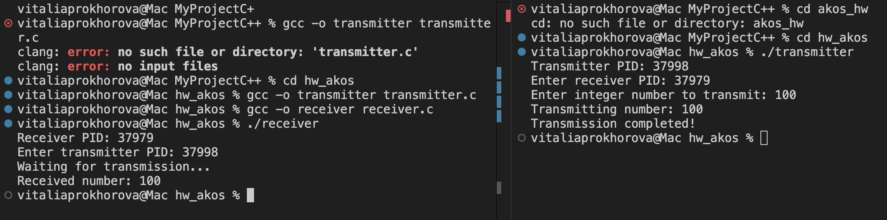

# Домашнее задание № 9 Сигналы
Выполнила: Прохорова Виталия БПИ244
### Отчет по работе:
1) Инициализация:
    - Каждая программа выводит свой PID и запрашивает PID собеседника.
2) Передача данных:
    - Передатчик преобразует число в 32 бита
    - Каждый бит передается отдельным сигналом (SIGUSR1 для 0, SIGUSR2 для 1)
    - После отправки каждого бита передатчик ждет подтверждения (SIGUSR1)
3) Прием данных:
    - Приемник получает сигналы и интерпретирует их как биты
    - После получения каждого бита отправляет подтверждение
    - После получения SIGINT восстанавливает число из битов
4) Завершение:
   - Передатчик отправляет SIGINT для завершения передачи.
### Пример работы:
 
